Chau_etal_Hires
================

# Load packages

``` r
library(tidyverse)
library(dplyr)
library(phyloseq)
library(DESeq2)
library(cowplot)
library(RColorBrewer)
library(pheatmap)
library(data.table)
library(apeglm)
library(ggrepel)
library(viridis)
library(pheatmap)
library(vegan)
library(factoextra)
library(FactoMineR)
```

# Create phyloseq object with added metadata

``` r
# Read in 16S DADA2 outputs, updated metadata file, pre-generated phylo tree (optional) 
setwd("data")
otu_mat <- read.csv("seqtab2.csv")
tax_mat <- read.csv("TaxaId16s.csv")
samples_df <- read.csv("sample_metadata_2.csv")
fitGTR <- readRDS("phylotree_fitGTR.rds")

# Clean files
samples_df$samples <- gsub("-", ".",samples_df$samples) # revert -/. change during read in
row.names(otu_mat) <- otu_mat$X # change first column to row names and remove first column
otu_mat <- otu_mat %>% select (-X)
row.names(tax_mat) <- tax_mat$X
tax_mat <- tax_mat %>% select (-X) 
row.names(samples_df) <- samples_df$samples
samples_df <- samples_df %>% select (-samples)
otu_mat <- as.matrix(otu_mat) # transform into matrices
tax_mat <- as.matrix(tax_mat)

# Create phyloseq object
OTU = otu_table(otu_mat, taxa_are_rows = TRUE)
TAX = tax_table(tax_mat)
samples = sample_data(samples_df)

carbom <- phyloseq(OTU, TAX, samples, phy_tree(fitGTR$tree))
#sample_variables(carbom) # check all variables accounted for

# Subset samples to leave only high resolution project samples
carbom_hires <- subset_samples(carbom, sample_type != "james" & sample_type != "longitudinal" & sample_type != "control")

# Remove depth outliers
carbom_hires1 <- prune_samples(sample_names(carbom_hires) != "KevChauPhD.1.A.D.03.HIRES.T20.16S.1", carbom_hires)
carbom_hires1 <- prune_samples(sample_names(carbom_hires1) != "KevChauPhD.1.A.F.04.HIRES.T30.16S.1", carbom_hires1)

carbom_hires1
```

    ## phyloseq-class experiment-level object
    ## otu_table()   OTU Table:         [ 5448 taxa and 73 samples ]
    ## sample_data() Sample Data:       [ 73 samples by 30 sample variables ]
    ## tax_table()   Taxonomy Table:    [ 5448 taxa by 7 taxonomic ranks ]
    ## phy_tree()    Phylogenetic Tree: [ 5448 tips and 5446 internal nodes ]

# DESeq2 method testing - identify optimal fit type and estimation of size factor method

``` r
# Convert phyloseq object to deseq2 object
carbom_hires_dds = phyloseq_to_deseq2(carbom_hires1, ~ hourly_day + hourly_time) # conversion into deseq2 object

# DESeq2 call with each fit type
carbom_hires_dds = DESeq(carbom_hires_dds, fitType = "local") # local regression of log dispersion over log base mean
carbom_hires_dds_para = DESeq(carbom_hires_dds, fitType = "parametric") # gamma-family GLM
carbom_hires_dds_mean = DESeq(carbom_hires_dds, fitType = "mean") # mean of gene-wise dispersion estimate

# Plot dispersion estimates to identify best fit type
plotDispEsts(carbom_hires_dds_para) # parametric
```

<!-- -->

``` r
plotDispEsts(carbom_hires_dds_mean) # mean
```

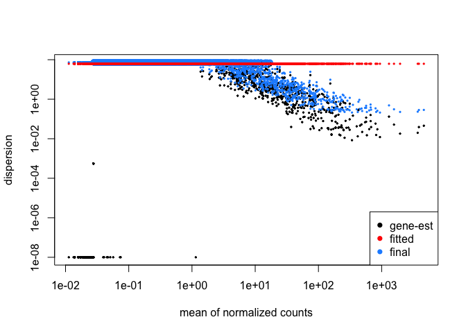<!-- -->

``` r
plotDispEsts(carbom_hires_dds) # local
```

<!-- -->

``` r
# Local fit is optimal - Remove poorly fit deseq2 objects
rm(carbom_hires_dds_para)
rm(carbom_hires_dds_mean)

# Sparsity plot - x=sum of counts per OTU(row) y= max proportion of count contributed by single sample
rs <- rowSums(counts(carbom_hires_dds))
rmx <- apply(counts(carbom_hires_dds), 1, max)
plot(rs+1, rmx/rs, log="x")
```

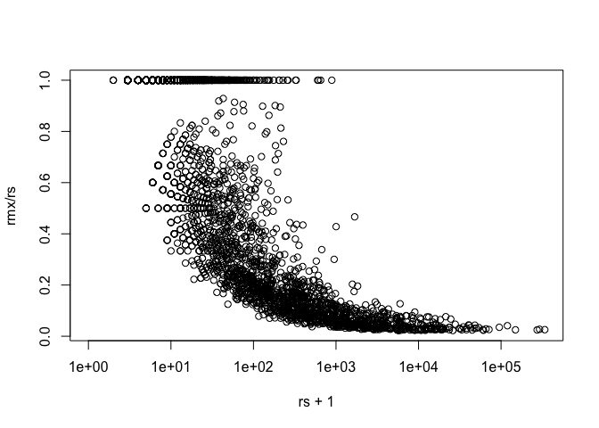<!-- -->

``` r
# Shows zero-inflated sparse data (as expected since metagenomic and not RNA expression data)
# Therefore, use alternate estimation of size factor method where zero counts are excluded in calculation
```

# DESeq2 call

``` r
# Check correct variables for study design
#unique(sample_data(carbom_hires1)$hourly_day)
#unique(sample_data(carbom_hires1)$hourly_time)

rm(carbom_hires_dds) # make sure to start fresh or may reuse old geomeans/dispersions
carbom_hires_dds = phyloseq_to_deseq2(carbom_hires1, ~ hourly_day + hourly_time) # Study design set to consider sampling day and timepoint

#sub space in levels with underscore and colon with full stop
levels(carbom_hires_dds$hourly_day) <- sub(" ", "_", levels(carbom_hires_dds$hourly_day)) # replace space in levels with underscore
levels(carbom_hires_dds$hourly_time) <- sub(":", ".", levels(carbom_hires_dds$hourly_time)) # replace space in levels with underscore

#alternative geomeans method for estimation of size factors 
gm_mean = function(x, na.rm=TRUE){
    exp(sum(log(x[x > 0]), na.rm=na.rm) / length(x))
}
geoMeans = apply(counts(carbom_hires_dds), 1, gm_mean)
carbom_hires_dds = estimateSizeFactors(carbom_hires_dds, geoMeans=geoMeans)

# DESeq2 call reusing alternative existing size factors and local fit found to be optimal
carbom_hires_dds = DESeq(carbom_hires_dds, fitType = "local") 
```

# Taxonomic barplot (16S)

``` r
# Add deseq2 normalised count to phyloseq object
foo <- counts(carbom_hires_dds, normalized = TRUE) # extract DESeq2 normalised counts (size factor normalised only)
#make a copy of original phyloseq object (raw counts) and replace raw counts with DESeq2 normalised counts
carbom_hires_deseq <- carbom_hires1
otu_table(carbom_hires_deseq) <- otu_table(foo, taxa_are_rows = TRUE) 

# melt to long for plotting
carbom_hires_deseq_melt <- carbom_hires_deseq %>%
  psmelt()

# summarise and subset to top 7 phlya for each sample
carbom_hires_deseq_melt.subset <- carbom_hires_deseq_melt %>%
  # summarise by sample type
  group_by(Sample, phylum, sample_type, hourly_time, hourly_day, comp_day, total_16s) %>%
  summarise(abun_sum=sum(Abundance)) 

mt <- carbom_hires_deseq_melt.subset[order(carbom_hires_deseq_melt.subset$abun_sum), ]
d <- by(mt, mt["Sample"], tail, n=7)
carbom_hires_deseq_melt_top7OTU <- Reduce(rbind, d)

level_order<- c("09:00","10:00", "11:00","12:00","13:00","14:00","15:00","16:00","17:00","18:00","19:00","20:00","21:00","22:00","23:00","00:00","01:00","02:00","03:00","04:00","05:00","06:00","07:00","08:00")

carbom_hires_deseq_melt_top7OTU$phylum <- replace_na(carbom_hires_deseq_melt_top7OTU$phylum, "Other")
carbom_hires_deseq_melt_top7OTU$phylum <- factor(carbom_hires_deseq_melt_top7OTU$phylum, levels = c("Actinobacteriota","Bacteroidota","Campilobacterota","Firmicutes","Fusobacteriota","Proteobacteria", "Other"))
colours <-brewer.pal(6, "Dark2")
colours[7]<- "#808080"

a <-ggplot(carbom_hires_deseq_melt_top7OTU[carbom_hires_deseq_melt_top7OTU$sample_type =="hourly",], aes(x = factor(hourly_time, level=level_order), y = abun_sum, fill = phylum)) + 
  facet_grid(hourly_day~.) +
  geom_bar(stat = "identity") + ylim(c(0,100000)) + theme(axis.text.x = element_text(angle = 90)) + xlab("Time") + ylab("Abundance") + labs(fill="Phylum") + theme_bw() +labs(title="DESeq2-normalised abundance") + 
  scale_x_discrete(breaks=c("09:00", "13:00", "17:00", "21:00", "01:00", "05:00"), labels=c("09:00", "13:00", "17:00", "21:00", "01:00", "05:00")) + scale_fill_manual(values = colours)

b <-ggplot(carbom_hires_deseq_melt_top7OTU[carbom_hires_deseq_melt_top7OTU$sample_type =="composite",], aes(x = factor(hourly_time, level=level_order), y = abun_sum, fill = phylum)) + 
  facet_grid(comp_day~.) +
  geom_bar(stat = "identity") + theme(axis.text.x = element_text(angle = 90)) + xlab("Composite") + labs(fill="Phylum") + ylim(c(0,100000)) + theme(axis.text.x = element_blank(), axis.title.y = element_blank(), axis.text.y = element_blank()) + 
theme(
  strip.background = element_blank(),
  strip.text.y = element_blank(), panel.background = element_blank(), panel.border = element_rect(colour="black", fill=NA), panel.grid.major = element_line(colour = "grey90", size = 0.2), panel.grid.minor = element_line(colour = "grey90", size = 0.5)
) +theme(axis.title.x=element_text(size=8)) +
    theme(plot.margin = unit(c(0,0,0,0), "cm")) + scale_fill_manual(values = colours)

leg<- get_legend(a+  theme(legend.box.margin = margin(0, 0, 0, 0)) + 
  theme(legend.justification = "top"))
pcow <- plot_grid(a + theme(legend.position="none"), b + theme(legend.position="none"), align="h",axis = "bt", ncol=2, nrow=1,  rel_widths = c(1, 0.07))
plot_grid(pcow + theme(plot.margin = unit(c(0, 1, 0, 1), "cm")), leg , rel_widths = c(3, .4)) 
```

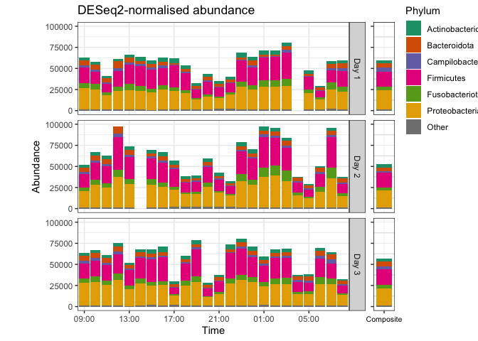<!-- -->

``` r
#ggsave("Barplot_DESeq2-counts_sample.png", width = 12, height = 10)
```

# Taxonomic line plot with standard error

``` r
a <- ggplot(carbom_hires_deseq_melt_top7OTU[carbom_hires_deseq_melt_top7OTU$sample_type =="hourly",], aes(x = factor(hourly_time, level=level_order), y = abun_sum, group=phylum)) + 
  stat_summary(fun=mean, geom="line", aes(group=phylum, colour=phylum), size = 0.6) +
  stat_summary(fun=mean, geom="point", aes(group=phylum, fill=phylum), size = 2, shape=21, colour="black") +
  stat_summary(fun.data = mean_se,geom = "ribbon", aes(group=phylum, fill=phylum) , alpha = 0.1) + ylim(c(0,40000)) + theme(axis.text.x = element_text(angle = 90)) + scale_colour_brewer(palette = "Dark2", na.value = "grey30") + xlab("Time") + ylab("Abundance") + labs(fill="phylum") + theme_bw() +labs(title="DESeq2-normalised abundance +/- SE") + 
  scale_x_discrete(breaks=c("09:00", "13:00", "17:00", "21:00", "01:00", "05:00"), labels=c("09:00", "13:00", "17:00", "21:00", "01:00", "05:00")) + scale_fill_manual(values = colours) + guides(fill=guide_legend(title="Phylum"), colour=guide_legend(title="Phylum")) 

b<-ggplot(carbom_hires_deseq_melt_top7OTU[carbom_hires_deseq_melt_top7OTU$sample_type =="composite",], aes(x = factor(hourly_time, level=level_order), y = abun_sum, group=phylum)) + 
  stat_summary(fun=mean, geom="line", aes(group=phylum, colour=phylum), size = 0.6) +
  stat_summary(fun.data = mean_se,geom = "errorbar", aes(group=phylum, fill=phylum)) + ylim(c(0,40000)) +
  stat_summary(fun=mean, geom="point", aes(group=phylum, fill=phylum), size = 2, shape=21, colour="black") + theme(axis.text.x = element_text(angle = 90)) + scale_colour_brewer(palette = "Dark2", na.value = "grey30") + xlab("Time") + ylab("Abundance") + labs(fill="phylum") + theme_bw() + xlab("Composite") + labs(fill="Phylum") + theme(axis.text.x = element_blank(), axis.title.y = element_blank(), axis.text.y = element_blank()) + 
theme(
  strip.background = element_blank(),
  strip.text.y = element_blank(), panel.background = element_blank(), panel.border = element_rect(colour="black", fill=NA), panel.grid.major = element_line(colour = "grey90", size = 0.2), panel.grid.minor = element_line(colour = "grey90", size = 0.5)
) +theme(axis.title.x=element_text(size=8)) +
    theme(plot.margin = unit(c(0,0,0,0), "cm")) + scale_fill_manual(values = colours)

leg<- get_legend(a+  theme(legend.box.margin = margin(0, 0, 0, 0)) + 
  theme(legend.justification = "top"))
pcow <- plot_grid(a + theme(legend.position="none"), b + theme(legend.position="none"), align="h",axis = "bt", ncol=2, nrow=1,  rel_widths = c(1, 0.07))
plot_grid(pcow + theme(plot.margin = unit(c(0, 1, 0, 1), "cm")), leg , rel_widths = c(3, .4)) 
```

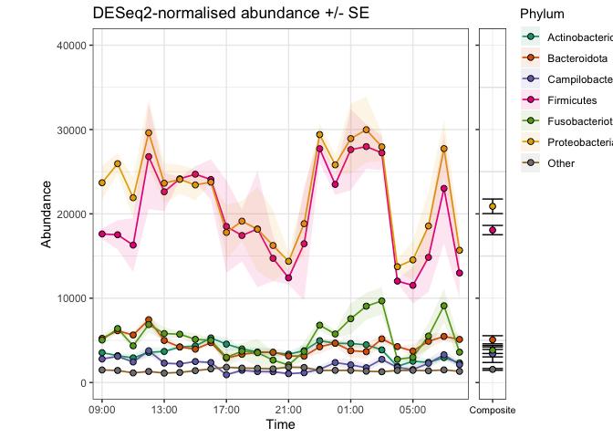<!-- -->

``` r
#ggsave("Line_SE_DESeq2_counts.png", width = 12, height = 10)
```

# Taxonomic line plot with confidence interval

``` r
carbom_hires_deseq_melt_top7OTU$phylum <- replace_na(carbom_hires_deseq_melt_top7OTU$phylum, "Other")
carbom_hires_deseq_melt_top7OTU$phylum <- factor(carbom_hires_deseq_melt_top7OTU$phylum, levels = c("Actinobacteriota","Bacteroidota","Campilobacterota","Firmicutes","Fusobacteriota","Proteobacteria", "Other"))
colours <-brewer.pal(6, "Dark2")
colours[7]<- "#808080"

a <- ggplot(carbom_hires_deseq_melt_top7OTU[carbom_hires_deseq_melt_top7OTU$sample_type =="hourly",], aes(x = factor(hourly_time, level=level_order), y = abun_sum, group=phylum)) + 
  stat_summary(fun=mean, geom="line", aes(group=phylum, colour=phylum), size = 0.6) +
  stat_summary(fun=mean, geom="point", aes(group=phylum, fill=phylum), size = 2, shape=21, colour="black") +
  stat_summary(fun.data = mean_cl_boot,geom = "ribbon", aes(group=phylum, fill=phylum), alpha = 0.1)+ ylim(c(0,40000)) + theme(axis.text.x = element_text(angle = 90)) + scale_colour_brewer(palette = "Dark2", na.value = "grey30") + xlab("Time") + ylab("Abundance") + labs(fill="phylum") + theme_bw() +labs(title="DESeq2-normalised abundance +/- CI") + 
  scale_x_discrete(breaks=c("09:00", "13:00", "17:00", "21:00", "01:00", "05:00"), labels=c("09:00", "13:00", "17:00", "21:00", "01:00", "05:00")) + scale_fill_manual(values = colours) + guides(fill=guide_legend(title="Phylum"), colour=guide_legend(title="Phylum")) 

b<-ggplot(carbom_hires_deseq_melt_top7OTU[carbom_hires_deseq_melt_top7OTU$sample_type =="composite",], aes(x = factor(hourly_time, level=level_order), y = abun_sum, group=phylum)) + 
  stat_summary(fun=mean, geom="line", aes(group=phylum, colour=phylum), size = 0.6) +
  stat_summary(fun.data = mean_cl_boot,geom = "errorbar", aes(group=phylum, fill=phylum)) + ylim(c(0,40000)) +
  stat_summary(fun=mean, geom="point", aes(group=phylum, fill=phylum), size = 2, shape=21, colour="black") + theme(axis.text.x = element_text(angle = 90)) + scale_colour_brewer(palette = "Dark2", na.value = "grey30") + xlab("Time") + ylab("Abundance") + labs(fill="phylum") + theme_bw() + xlab("Composite") + labs(fill="Phylum") + theme(axis.text.x = element_blank(), axis.title.y = element_blank(), axis.text.y = element_blank()) + 
theme(
  strip.background = element_blank(),
  strip.text.y = element_blank(), panel.background = element_blank(), panel.border = element_rect(colour="black", fill=NA), panel.grid.major = element_line(colour = "grey90", size = 0.2), panel.grid.minor = element_line(colour = "grey90", size = 0.5)
) +theme(axis.title.x=element_text(size=8)) +
    theme(plot.margin = unit(c(0,0,0,0), "cm")) + scale_fill_manual(values = colours)

leg<- get_legend(a+  theme(legend.box.margin = margin(0, 0, 0, 0)) + 
  theme(legend.justification = "top"))
pcow <- plot_grid(a + theme(legend.position="none"), b + theme(legend.position="none"), align="h",axis = "bt", ncol=2, nrow=1,  rel_widths = c(1, 0.07))
plot_grid(pcow + theme(plot.margin = unit(c(0, 1, 0, 1), "cm")), leg , rel_widths = c(3, .4)) 
```

<!-- -->

``` r
#ggsave("Line_CI_DESeq2_counts.png", width = 12, height = 10)
```

# Principle component analysis

``` r
# DESeq2 method to deal with heteroscedasticity (unequal variances)
vsd <- varianceStabilizingTransformation(carbom_hires_dds, blind=FALSE) #blind = false, takes into account study design - can blind for testing purposes

# Extract and process PCA data
pcaData <- plotPCA(vsd, intgroup=c("sample_type", "hourly_time", "hourly_day"), returnData=TRUE)
percentVar <- round(100 * attr(pcaData, "percentVar"))
pcaMeta <- read.csv("data/pcaMeta.csv") # read in metadata for plotting
pcaData <- cbind(pcaData, pcaMeta)
pcaData$hourly_time<-as.character(pcaData$hourly_time)
pcaData$hourly_time <- substr(pcaData$hourly_time,1,nchar(pcaData$hourly_time)-3) #convert time to scale for colouring points
pcaData$hourly_time<-as.double(pcaData$hourly_time)
pcaData$time_period2<-as.factor(pcaData$time_period2)
pcaData$hourly_day <- gsub("_", " ", pcaData$hourly_day)


# Plot
ggplot(pcaData, aes(PC1, PC2, colour=hourly_time, shape = hourly_day, group=time_period2)) +
  geom_point(size=3) +  
  xlab(paste0("PC1: ",percentVar[1],"% variance")) +
  ylab(paste0("PC2: ",percentVar[2],"% variance")) + 
  coord_fixed()+ 
  scale_colour_viridis(name = "Grab sampling time", option = "D", na.value="red", breaks=c(0,5,10,15,20), labels=c("00:00","05:00","10:00", "15:00", "20:00")) + 
  geom_text_repel(aes(label=time_label),max.overlaps = 8, size =3) + 
  labs(shape = "Sampling day") + 
  theme_bw() 
```

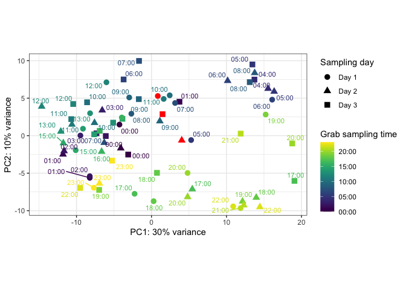<!-- -->

# Hierachical clustering of principle components

``` r
# calculate the variance for each gene
rv <- rowVars(assay(vsd))
# select the ntop genes by variance
select <- order(rv, decreasing=TRUE)[seq_len(min(500, length(rv)))]
# perform PCA on transposed vsd (same result as plotPCA and by extension prcomp but allows use of HCPC)
res.pca <- PCA(t(assay(vsd)[select,]),graph = F, scale.unit = F)

# reverse loadings (scale_x/y_reverse) to match prcomp/plotPCA
plot((res.pca), axes=c(1,2), label="none") + scale_x_reverse() + scale_y_reverse()
```

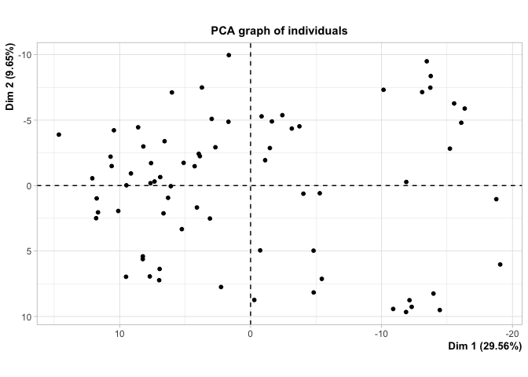<!-- -->

``` r
# hierarchical clustering of principle components 
res.hcpc <- HCPC(res.pca, graph = FALSE)

# dendrogram of clusters
fviz_dend(res.hcpc, 
          cex = 0.7,
          show_labels = F,
          palette = "jco",
          rect = TRUE, rect_fill = TRUE, 
          rect_border = "jco",           
          labels_track_height = 0.8      
          ) 
```

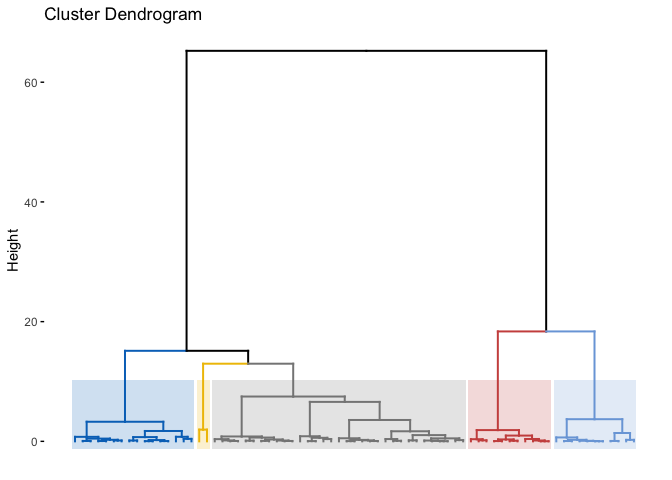<!-- -->

``` r
# clusters mapped to PCA plot
fviz_cluster(res.hcpc,
             repel = TRUE,
             geom = "point",
             show.clust.cent = TRUE, 
             palette = "jco",         
             ggtheme = theme_minimal(),
             main = "Factor map"
             ) + scale_x_reverse() + scale_y_reverse()
```

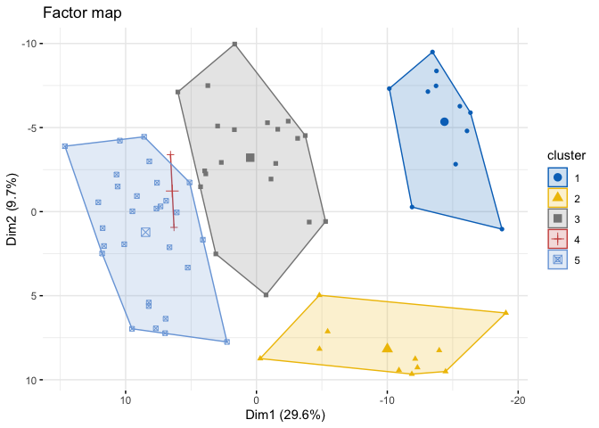<!-- -->

``` r
# get clusters IDs and append to pca data
pcaData$clusters <- res.hcpc$data.clust$clust

# set colours for drawing ellipses to match time period of most samples forming clusters
pcaData$clust_col <- ifelse(pcaData$clusters==3, paste(8.5), ifelse(pcaData$clusters==1, paste(6),ifelse(pcaData$clusters==2, paste(20),ifelse(pcaData$clusters==5, paste(13.5), 0))))
pcaData$clust_col <- as.double(pcaData$clust_col)

# define samples which also underwent shotgun sequencing for labelling
metag_subset <-c("KevChauPhD.1.A.A.01.HIRES.T1.16S.1","KevChauPhD.1.A.E.01.HIRES.T5.16S.1","KevChauPhD.1.A.A.02.HIRES.T9.16S.1","KevChauPhD.1.A.E.02.HIRES.T13.16S.1","KevChauPhD.1.A.A.03.HIRES.T17.16S.1","KevChauPhD.1.A.E.03.HIRES.T21.16S.1","KevChauPhD.1.A.A.10.HIRES.COMPOSITE.1.16S.1")

# Plot # three main ellipses - one small ellipses removed as too few points to calculate
ggplot(pcaData, aes(PC1, PC2, colour=hourly_time, shape = hourly_day, group=clusters)) +
  geom_point(size=3) +  
  xlab(paste0("PC1: ",percentVar[1],"% variance")) +
  ylab(paste0("PC2: ",percentVar[2],"% variance")) + 
  coord_fixed()+ 
  scale_colour_viridis(name = "Grab sampling time", option = "D", na.value="red", breaks=c(0,5,10,15,20), labels=c("00:00","05:00","10:00", "15:00", "20:00")) + 
  geom_text_repel(aes(label=time_label),max.overlaps = 8, size =3) + 
  labs(shape = "Sampling day") + 
  theme_bw() + 
  stat_ellipse(aes(color=clust_col)) +
    geom_point(data=pcaData[pcaData$name %in% metag_subset,],
             pch=22, 
             size=6, colour="blue") 
```

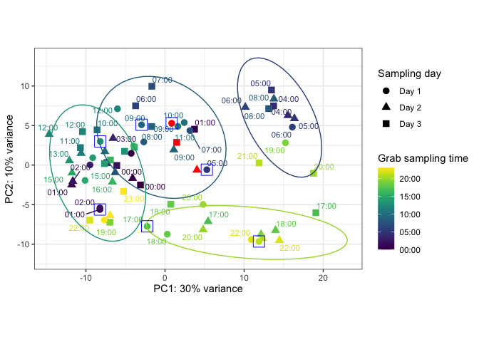<!-- -->

``` r
#ggsave("PCA_HCPC_ord_plot.png", width = 9, height = 6)
```

# Fit nutrient concentrations as environmental variables to PCA

``` r
# calculate the variance for each gene
rv <- rowVars(assay(vsd))
# select the ntop genes by variance
select <- order(rv, decreasing=TRUE)[seq_len(min(500, length(rv)))]
# perform a PCA on the data in assay(x) for the selected genes
pca <- prcomp(t(assay(vsd)[select,]))
plot(pca)
```

<!-- -->

``` r
# read in nutrient metadata
pcaMeta <- read.csv("data/nutrient_data.csv")

# fit environmental variables
# normalised nutrients
pca.fit<- envfit(pca ~ Soluble.reactive.phosphorus.normalised   +Total.dissolved.phosphorus.normalised  +Total.phosphorus.normalised    +Dissolved.ammonium..NH4..normalised    +Dissolved.fluoride.normalised  +Dissolved.chloride.normalised  +Dissolved.nitrite.normalised   +Dissolved.nitrate.normalised   +Dissolved.sulphate.normalised, pcaMeta, choices=c(1:2), na.rm=TRUE)
ordiplot(pca, display="sites")
plot(pca.fit)
```

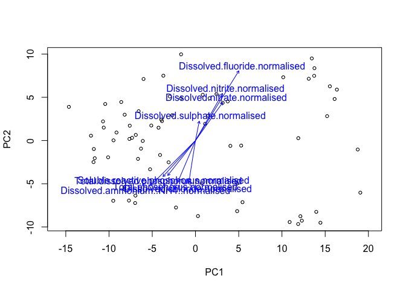<!-- -->

``` r
#                                            PC1      PC2     r2 Pr(>r)   
#Soluble.reactive.phosphorus.normalised -0.62232 -0.78276 0.1886  0.192   
#Total.dissolved.phosphorus.normalised  -0.66951 -0.74280 0.2229  0.148   
#Total.phosphorus.normalised            -0.39227 -0.91985 0.1953  0.189   
#Dissolved.ammonium..NH4..normalised    -0.70632 -0.70789 0.3791  0.028 * 
#Dissolved.fluoride.normalised           0.52861  0.84887 0.6389  0.002 **
#Dissolved.chloride.normalised          -0.15725 -0.98756 0.1767  0.209   
#Dissolved.nitrite.normalised            0.49809  0.86713 0.2792  0.068 . 
#Dissolved.nitrate.normalised            0.58154  0.81352 0.2067  0.151   
#Dissolved.sulphate.normalised           0.19149  0.98150 0.0369  0.762   

# just significant nutrients
pca.fit<- envfit(pca ~ Dissolved.ammonium..NH4..normalised  +Dissolved.fluoride.normalised  +Dissolved.nitrite.normalised, pcaMeta, choices=c(1:2), na.rm=TRUE)
ordiplot(pca, display="sites")
plot(pca.fit)
```

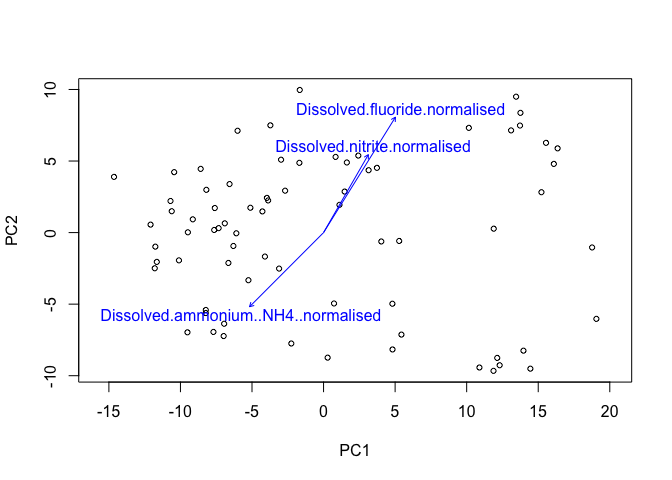<!-- -->

``` r
# fit flow rate
pca.fit<- envfit(pca ~ flow_min +flow_3min  +flow_10min, pcaMeta, choices=c(1:2), na.rm=TRUE) 
ordiplot(pca, display="sites")
plot(pca.fit)
```

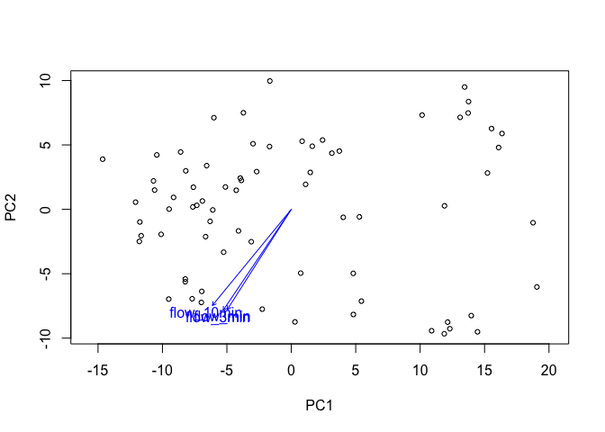<!-- -->

``` r
# plot of both
pca.fit<- envfit(pca ~ Dissolved.ammonium..NH4..normalised  +Dissolved.fluoride.normalised  +Dissolved.nitrite.normalised+flow_min  +flow_3min  +flow_10min, pcaMeta, choices=c(1:2), na.rm=TRUE)
png("sig_nutrients_flow_pca.png", width = 700, height = 700)
 ordiplot(pca, display="sites")
plot(pca.fit)
dev.off()
```

    ## quartz_off_screen 
    ##                 2

# Metagenomic MASH distance

``` r
mash_mat <- read.csv("data/distance_matrix.csv")

colnames(mash_mat)<- c("NA","Composite", "09:00", "13:00", "17:00", "21:00", "01:00","05:00")

make.matrix<-function(x) {
    m<-as.matrix(x[,-1])
    rownames(m)<-x[,1]
    m
}
mash_dist <-make.matrix(mash_mat)

mash_hm <- pheatmap(mash_dist, scale = "none", cutree_rows = 2, cutree_cols =  2, width = 7.5 , height=7, color = colorRampPalette(c("white", "black"))(100))
```

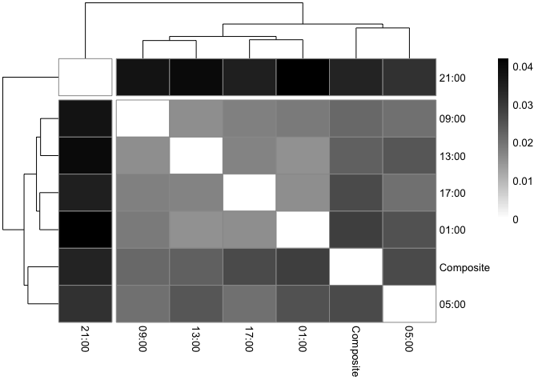<!-- -->

# Recreate fresh phyloseq object with coded time for LRT testing

``` r
# (i.e. 9am = 0, 10am = 10 and so on until 8am = 23) so baseline is at 9am (0)
# Read in 16S DADA2 outputs, updated metadata file, pre-generated phylo tree (optional) 
setwd("data")
otu_mat <- read.csv("seqtab2.csv")
tax_mat <- read.csv("TaxaId16s.csv")
samples_df <- read.csv("sample_metadata_2.csv")
fitGTR <- readRDS("phylotree_fitGTR.rds")

# Clean files
samples_df$samples <- gsub("-", ".",samples_df$samples) # revert -/. change during read in
row.names(otu_mat) <- otu_mat$X # change first column to row names and remove first column
otu_mat <- otu_mat %>% select (-X)
row.names(tax_mat) <- tax_mat$X
tax_mat <- tax_mat %>% select (-X) 
row.names(samples_df) <- samples_df$samples
samples_df <- samples_df %>% select (-samples)
otu_mat <- as.matrix(otu_mat) # transform into matrices
tax_mat <- as.matrix(tax_mat)

# Create phyloseq object
OTU = otu_table(otu_mat, taxa_are_rows = TRUE)
TAX = tax_table(tax_mat)
samples = sample_data(samples_df)

carbom <- phyloseq(OTU, TAX, samples, phy_tree(fitGTR$tree))
#sample_variables(carbom) # check all variables accounted for

# Subset samples to remove james samples and longitudinal and controls - leaving only high resolution project samples
carbom_hires <- subset_samples(carbom, sample_type != "james" & sample_type != "longitudinal" & sample_type != "control")

# Remove depth outliers
carbom_hires1 <- prune_samples(sample_names(carbom_hires) != "KevChauPhD.1.A.D.03.HIRES.T20.16S.1", carbom_hires)
carbom_hires1 <- prune_samples(sample_names(carbom_hires1) != "KevChauPhD.1.A.F.04.HIRES.T30.16S.1", carbom_hires1)

# Remove composite samples as these are not relevant to LRT testing of hourly time
carbom_hires1 <- subset_samples(carbom_hires1, sample_type != "composite")
```

# Likelihood ratio testing

``` r
# design formula is by sampling day and hour (~ hourly_day + hourly_time) - provide reduced design formula for LRT without time factor to compare full model (full design) vs reduced (no time factor) to test for any differences over time points

rm(carbom_hires_dds) # make sure to start fresh or may reuse old geomeans/dispersions
carbom_hires_dds = phyloseq_to_deseq2(carbom_hires1, ~ hourly_day + hourly_time_coded) # Study design set to consider sampling day and timepoint

#sub space in levels with underscore and colon with full stop
levels(carbom_hires_dds$hourly_day) <- sub(" ", "_", levels(carbom_hires_dds$hourly_day)) # replace space in levels with underscore

# set coded time as factor 
carbom_hires_dds$hourly_time_coded <- as.factor(carbom_hires_dds$hourly_time_coded)

#alternative geomeans method for estimation of size factors - as per previous testing
gm_mean = function(x, na.rm=TRUE){
    exp(sum(log(x[x > 0]), na.rm=na.rm) / length(x))
}
geoMeans = apply(counts(carbom_hires_dds), 1, gm_mean)
carbom_hires_dds = estimateSizeFactors(carbom_hires_dds, geoMeans=geoMeans)

# LRT call and extract results
carbom_hires_LRT <- DESeq(carbom_hires_dds, test="LRT", reduced=~hourly_day, fitType = "local")
res <- results(carbom_hires_LRT)

#make dataframe with tax IDs 
resLRTtab = cbind(as(res, "data.frame"), as(tax_table(carbom_hires1)[rownames(res), ], "matrix"))
setDT(resLRTtab, keep.rownames = "OTU")[]

# filter significant OTUs only
resLRTtab2 <- resLRTtab %>% filter(padj < 0.05) #85 OTUs with significantly different abundance due to time of sampling
#write.csv(resLRTtab2, "resLRTtab2.csv")

# extract coefficients for each variable level comparison
betas <- coef(carbom_hires_LRT)
colnames(betas) # baselines are coded time 0 (i.e. samples taken at 9am) and sample batch from Day 1

# select only significant OTUs (85 as per filter result above)
sigOTUs <- head(order(res$padj),85)
LRT_mat <- betas[sigOTUs, -c(1,2)]
LRT_mat <- as.data.frame(LRT_mat)
LRT_mat$OTU <-rownames(LRT_mat)
rownames(LRT_mat) <-NULL
# add phylum classifications for labelling
LRT_mat <- left_join(LRT_mat, resLRTtab2[,c(1,9)])
# remove OTUs without phylum classifications
LRT_mat <- LRT_mat[complete.cases(LRT_mat), ] 
# clean df
LRT_mat$phylum <- gsub("Campilobacterota","Campylobacteriota",LRT_mat$phylum)
colnames(LRT_mat)<- c("Grabs Day 3 vs Day 1", "Grab 10:00 vs 9:00", "Grab 11:00 vs 9:00", "Grab 12:00 vs 9:00", "Grab 13:00 vs 9:00", "Grab 14:00 vs 9:00", "Grab 15:00 vs 9:00", "Grab 16:00 vs 9:00", "Grab 17:00 vs 9:00", "Grab 18:00 vs 9:00", "Grab 19:00 vs 9:00", "Grab 20:00 vs 9:00", "Grab 21:00 vs 9:00", "Grab 22:00 vs 9:00", "Grab 23:00 vs 9:00", "Grab 00:00 vs 9:00", "Grab 1:00 vs 9:00", "Grab 2:00 vs 9:00", "Grab 3:00 vs 9:00", "Grab 4:00 vs 9:00", "Grab 5:00 vs 9:00", "Grab 6:00 vs 9:00", "Grab 7:00 vs 9:00", "Grab 8:00 vs 9:00", "OTU", "Phylum")
# code duplicates for row names
rownames(LRT_mat) <- make.unique(LRT_mat$Phylum)
# prep phylum annotation 
row_labels <- LRT_mat[c(26)]
mycolours = list(Phylum=c(Actinobacteriota= "#1B9E77", Chloroflexi = "#D95F02", Proteobacteria= "#7570B3", Bacteroidota= "#E7298A", Firmicutes="#66A61E",Campylobacteriota= "#E6AB02",Fusobacteriota= "#A6761D",Acidobacteriota="#666666"))
LRT_mat$Phylum <-NULL
LRT_mat$OTU <- NULL
# convert back to matrix class
LRT_mat <- as.matrix(LRT_mat)
thr <- 2 # arbitrary threshold for ease of interpretation - all log2diff over or under 2 set as 2 or -2 respectively
LRT_mat[LRT_mat < -thr] <- -thr
LRT_mat[LRT_mat > thr] <- thr
```

# LRT heatmap

``` r
pheatmap(LRT_mat, breaks=seq(from=-thr, to=thr, length=101),annotation_row = row_labels, annotation_colors = mycolours,
         cluster_col=FALSE, fontsize_row = 4, fontsize_col = 6, show_rownames = F)
```

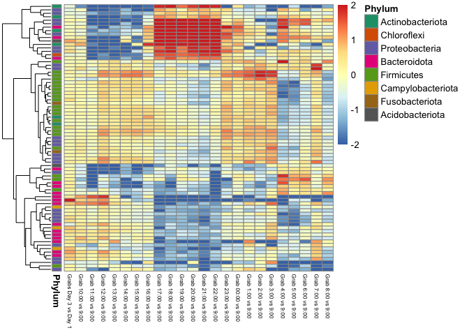<!-- -->

# Metagenomic AMR using respipe output

``` r
respipe <- read.csv("data/hires_respipe_lat_coverage.csv")
colnames(respipe)<- c("AMR_Gene_Family", "Composite", "09:00", "13:00", "17:00", "21:00", "01:00", "05:00")

# remove AMR gene families with zero lat coverage across all samples
respipe <- respipe[rowSums(respipe[,2:8])>0,]

#convert into a data matrix but retain AGF as row names
data <- respipe
rnames <- respipe$AMR_Gene_Family                           # assign labels in column 1 to "rnames"
mat_data <- data.matrix(data[,2:8])  # transform column 2-5 into a matrix
rownames(mat_data) <- rnames                  # assign row names


lateral_heatmap <- pheatmap(mat_data, scale = "none", cutree_rows = 3, cluster_cols = TRUE, cluster_rows = T, fontsize_row = 4, fontsize_col = 6, color = colorRampPalette(c("white", "black"))(100))
```

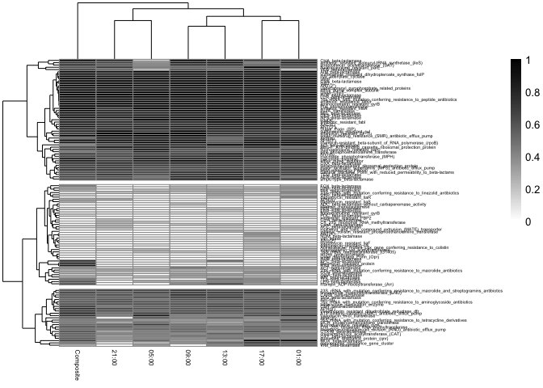<!-- -->

``` r
# extract data with clusters
AGF.clust <- cbind(mat_data, 
                      cluster = cutree(lateral_heatmap$tree_row, 
                                       k = 3))
```

# Subset of AMR gene families

``` r
respipe <- read.csv("data/hires_respipe_lat_coverage.csv")
colnames(respipe)<- c("AMR_Gene_Family", "Composite", "09:00", "13:00", "17:00", "21:00", "01:00", "05:00")

# remove AMR gene families with zero lat coverage across all samples
respipe <- respipe[rowSums(respipe[,2:8])>0,]

# subset AGF of interest
AGF_oi <- c("OXA_beta-lactamase", "KPC_beta-lactamase","CTX-M_beta-lactamase","VIM_beta-lactamase","IMP_beta-lactamase","NDM_beta-lactamase")

respipe <- respipe[respipe$AMR_Gene_Family %in% AGF_oi, ]

#convert into a data matrix but retain AGF as row names
data <- respipe
rnames <- respipe$AMR_Gene_Family                           # assign labels in column 1 to "rnames"
mat_data <- data.matrix(data[,2:8])  # transform column 2-5 into a matrix
rownames(mat_data) <- rnames                  # assign row names


lateral_heatmap <- pheatmap(mat_data, scale = "none", cluster_cols = TRUE, fontsize_row = 6, fontsize_col = 8, color = colorRampPalette(c("white", "black"))(100))
```

<!-- -->
